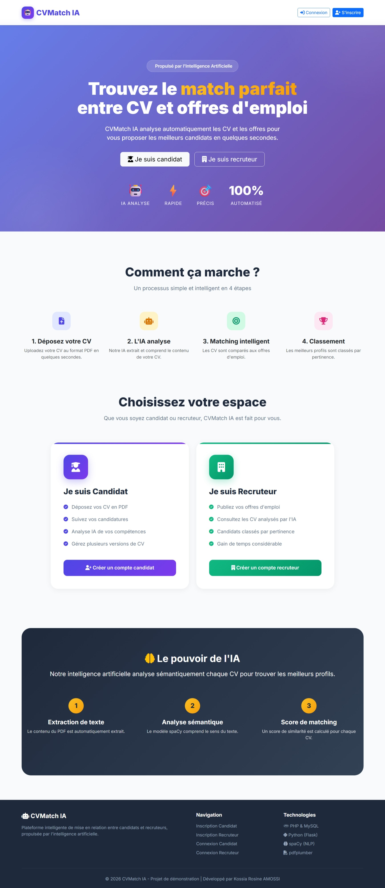
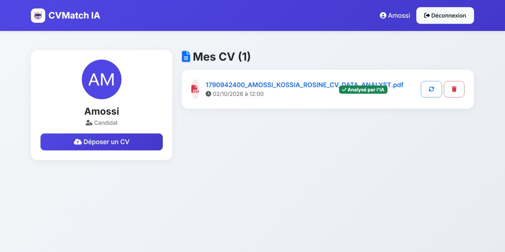
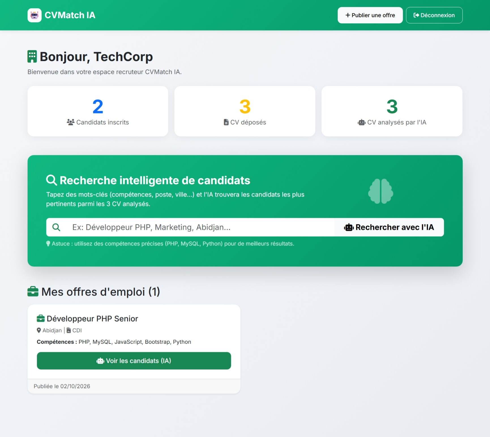

# 🤖 CVMatch IA

**Plateforme intelligente de mise en relation entre candidats et recruteurs, propulsée par l'Intelligence Artificielle.**

---

## 📖 À propos du projet

**CVMatch IA** est une application web full-stack qui automatise le processus de recrutement grâce à l'intelligence artificielle.

Les candidats déposent leur CV au format PDF. Les recruteurs décrivent le profil recherché en langage naturel, et **l'IA analyse chaque CV** pour retourner :

- ✅ Un **score de pertinence** (0 à 100)
- 📝 Une **justification** concise
- 💪 Les **points forts** du candidat
- ⚠️ Les **points faibles** du candidat

**Objectif** : faire gagner un temps précieux aux recruteurs en triant automatiquement les candidatures par pertinence.

---

---

## 📸 Aperçu de l'interface

### 🏠 Page d'accueil

### 👤 Espace Candidat

### 🏢 Espace Recruteur

---

## ✨ Fonctionnalités

### 👤 Espace Candidat
- Inscription et connexion sécurisées
- Upload de CV au format PDF (max 5 Mo)
- Remplacer ou supprimer un CV existant
- Extraction automatique du texte des PDF par l'IA
- Tableau de bord avec statut des CV (`En attente` / `Analysé`)

### 🏢 Espace Recruteur
- Inscription et connexion sécurisées
- Publication d'offres d'emploi
- Recherche libre par mots-clés (ex: "Développeur PHP Abidjan")
- Matching par offre : classement des candidats par pertinence
- Analyse détaillée de chaque candidat par l'IA
- Consultation directe des CV

### 🧠 Intelligence Artificielle
- Extraction de texte PDF avec pdfplumber
- Analyse sémantique avec **Groq API** (modèle openai/gpt-oss-120b)
- Prompt expert conçu pour reproduire le raisonnement d'un recruteur senior
- Score + justification + points forts/faibles en quelques secondes

---

## 🛠️ Stack Technique

| Couche | Technologie |
| :--- | :--- |
| Front-end | HTML5, CSS3, Bootstrap 5, Font Awesome |
| Back-end | PHP 8 (PDO), Python 3.10+ (Flask) |
| Base de données | MySQL 8 |
| IA | Groq API (openai/gpt-oss-120b) |
| Extraction PDF | pdfplumber |
| Sécurité | .env, password_hash, requêtes préparées PDO |

---

## 🚀 Installation

### Prérequis
- XAMPP (Apache + MySQL + PHP 8)
- Python 3.10+
- Une clé API Groq gratuite : https://console.groq.com

### Étapes

1. Cloner le projet : `git clone https://github.com/rosine-13/cvmatch-ia.git`
2. Créer la base `cvmatchia_db` dans phpMyAdmin et importer `database.sql`.
3. Copier `.env.example` en `.env` et remplir vos valeurs.
4. Installer les dépendances Python : `pip install -r requirements.txt`
5. Lancer le microservice : `python main.py`
6. Ouvrir dans le navigateur : `http://localhost/cvmatch-ia/`

---

## 📁 Structure du projet

- `config.php` — Configuration centrale
- `index.php` — Page d'accueil
- `assets/` — CSS et fichiers statiques
- `candidate/` — Espace candidat
- `recruiter/` — Espace recruteur
- `scripts_ia/` — Microservice IA (Python)
- `uploads/` — CV uploadés

---

## 🔒 Sécurité

- ✅ Mots de passe hashés avec `password_hash()` (bcrypt)
- ✅ Requêtes SQL préparées (PDO) contre les injections
- ✅ Échappement HTML avec `htmlspecialchars()`
- ✅ Clés API stockées dans un fichier `.env` non versionné
- ✅ Vérification des rôles sur chaque page protégée

---

## 🎯 Améliorations futures

- [ ] Chatbot IA pour aider les candidats à rédiger leur CV
- [ ] Notifications en temps réel
- [ ] Filtres avancés (expérience, ville, secteur)
- [ ] Export PDF des résultats
- [ ] Historique des recherches

---

## 👨‍💻 Auteur

**Rosine Amossi**
- GitHub : [@rosine-13](https://github.com/rosine-13)

---

## 📄 Licence

Ce projet est sous licence MIT.

---

⭐ **Si ce projet vous a plu, n'hésitez pas à lui mettre une étoile !**